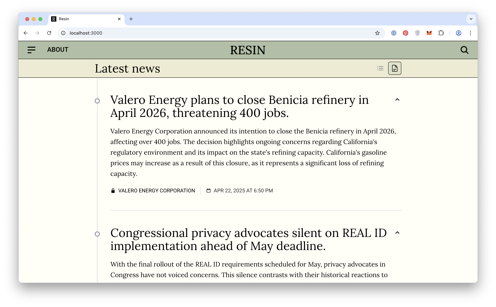

**Resin** is an automated news system that removes journalists and opinions and surfaces raw data directly to readers.

[resin.news](resin.news)



## Running locally

```bash
>   nvm use      # Load NPM version
>   npm install  # Install dependencies
>   vercel dev   # Serve app locally
```

API is available at https://localhost:3000

## Architecture

TODO
